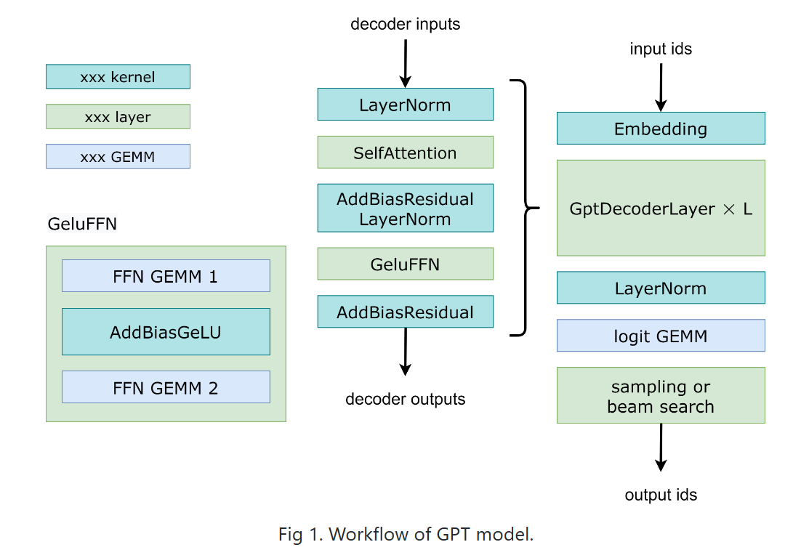
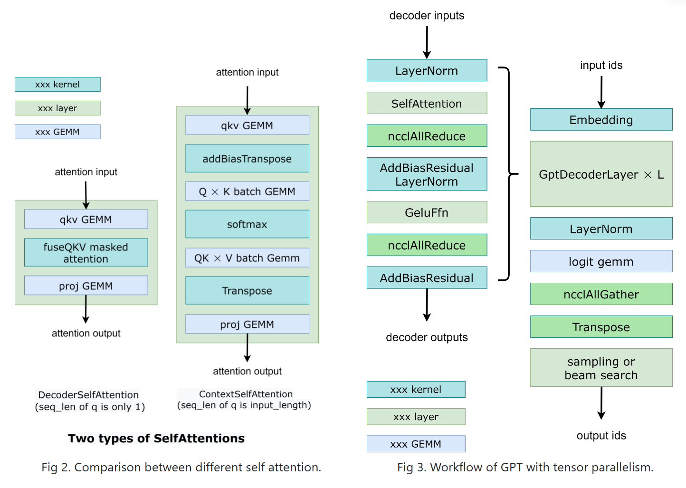
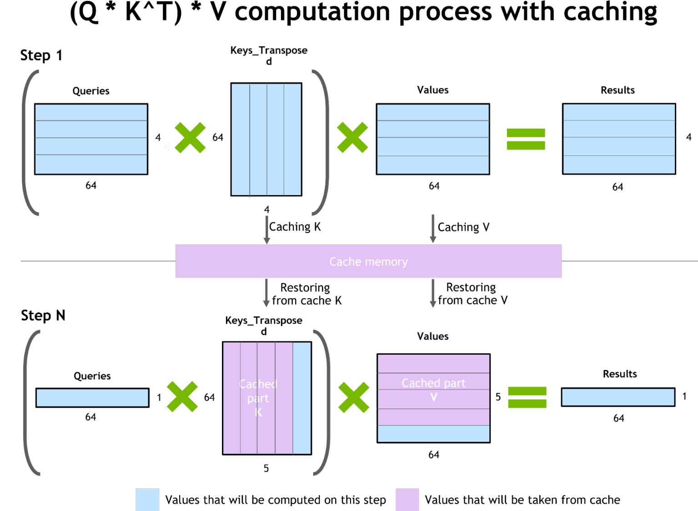
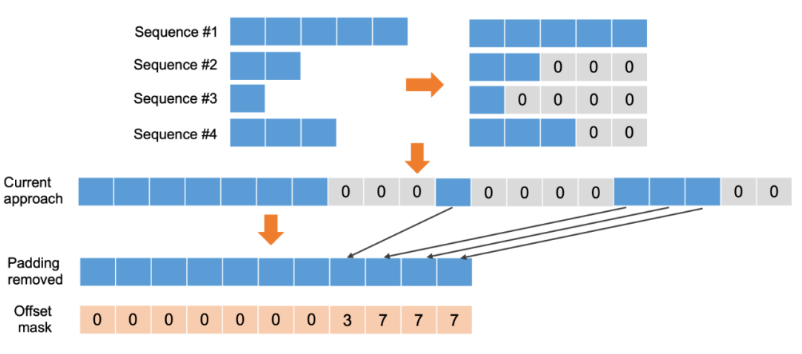
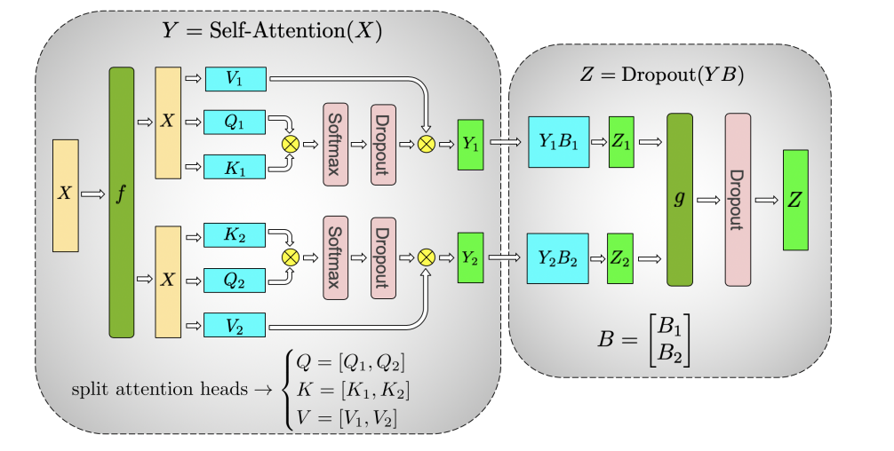
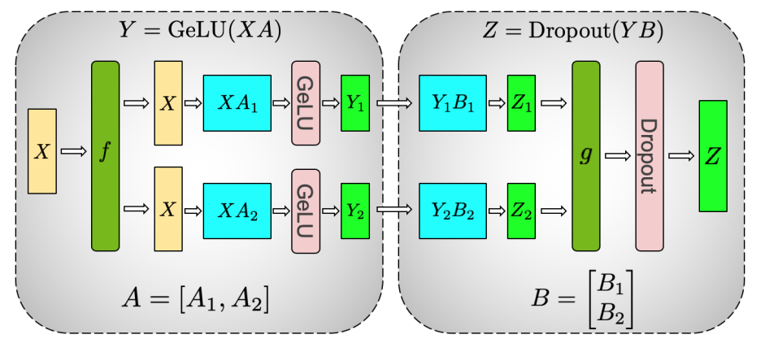
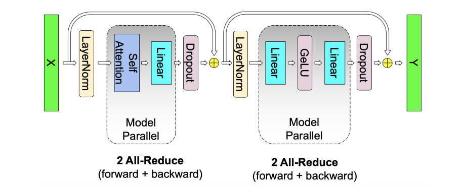
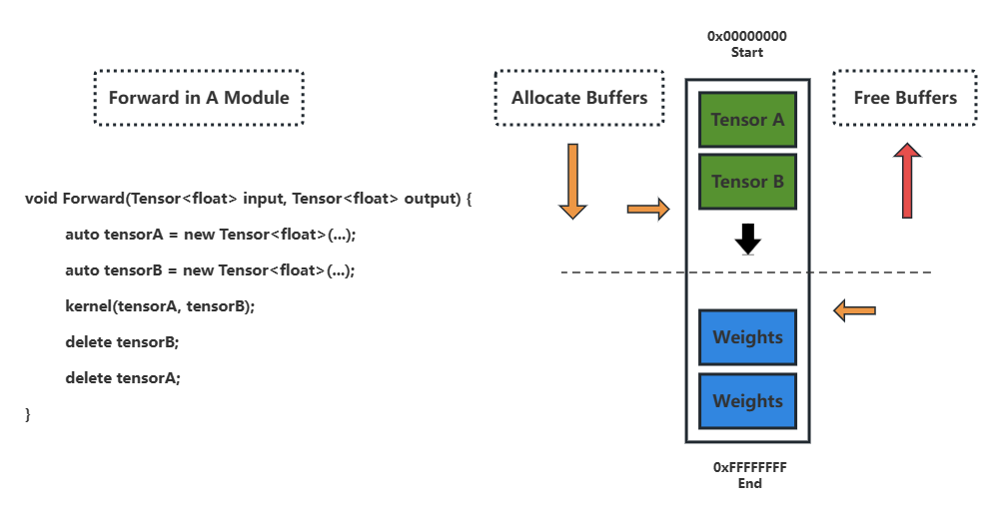

# Transformer: OpenAI GPT-2 Inference Acceleration

## Fast Transformer Overview 

Fast Transformer（FT）框架建立的目的在于深度优化带有 Transformer Encoder/Decoder 结构的模型的推理，专门针对 Transformer 结构实现包括算子融合、高效的内存管理和低精度量化推理等常见的推理优化方法，并且支持分布式推理以缓解模型显存占用量过大的问题。 

以 GPT-2 为推理实例 FT 推理包括两个阶段：

- Context 构建阶段：输入一定长度的 tokens 计算原文的 Q、K、V 注意力矩阵并缓存。
- Auto-regressive 自回归阶段：不断输入自回归模型的上一次输出，计算新的注意力矩阵同时加载Context 阶段计算的原文的注意力缓存矩阵并拼接，继续前向执行自回归计算得到后续的输出。

### 推理优化方案

#### Kernel Fusion

为了减少细粒度的 Kernel 计算，减少内存访问和 Kernel 启动的时间，Fast Transformer GPT-2 将原模型的60多个 Kernel 中除 GEMM 以外的其他 Kernel 融合为14个 Kernel。主要的融合出现在 addBias、addResidual、LayerNorm 和 Activation Function 上，Kernel 计算的流程为：



除上述融合的 Kernel 之外，GEMM 使用 cuBlas 库实现，并且在半精度的情况下通过 cuBlas 调用 Tensor Core 实现低误差的半精度的矩阵乘积运算。对于注意力模块的计算，按照 GPT-2 实现阶段上细分存在两种不同情况的Kernels，Context 阶段和 Auto-regressive 阶段的 Kernels Workflow：



由于两个阶段的输入形状不同，需要分别实现两种输入下的 Kernels 并且实现不同的线程配置。在 Context 阶段注意力模块的输入维度为[seq_len, hidden_size]，而 Auto-regressive 阶段注意力模块的输入维度始终为[1, hidden_size]，这里 hidden_size 表示词嵌入后特征向量的维度。同时，Fast Transformer 根据不同的输入 batch size 来配置对应 Kernel 的线程分布，包括实现不同的 GEMM ，根据序列长度制定不同 Softmax、Layernorm 的实现。

#### 内存优化

Fast Transformer 在内存优化中主要包括以下三点：

- **自回归模型的注意力矩阵缓存**

在 GPT-2 计算过程中由于自回归的模型特性，每次注意矩阵计算会根据新的输入再次计算各个 token 之间的注意力分数，但实际上这样的计算存在大量冗余。因为在 Context 阶段，所有原文的 token 之间已经相互做过向量内积，已经计算出了它们之间的余弦相似度。因此在自回归阶段新生成的 token 只需要与先前存在的 token 计算注意力分数即可。

根据这个特性可以在 Context 阶段将已经计算过的 Q、K、V 矩阵暂存在缓冲区，待自回归阶段生成新的 token 并进入注意力计算模块后再取出缓存的注意力矩阵计算新的 token 与之前 token 之间的注意力分数：



- **多层 Decoder 输出缓冲区的内存复用**

针对 Decoder 批处理输入数据而无须缓存中间数据这一特点，可以将 Decoder 的内存分为两大块分别为：Buffer A 和 Buffer B。第 I 层从 Buffer A 读取数据写入 Buffer B，第 I+1 层会从 Buffer B 读取第 I 层的输出，同时将输出写入 Buffer A。这样可避免每层单独开辟内存空间，能将 Decoder 占用的内存减小为原来的 1/N（N 是 Decoder 的层数），此方法可极大地节省 Decoder 在运行过程中所占用的内存。注意在实现缓冲区重用时需要在 Host 交换指针，因此需要进行设备同步，保证 Kernel 启动时指向的内存为可复用内存。

- **内存预分配技术（内存池）**

Fast Transformer 通过预分配内存的方法来避免推理过程中频繁的缓冲区 malloc 操作导致的调用与分配内存带来的时间开销，同时避免大量内存碎片的产生。其底层通过 CUDA 11.0 之后支持的 `cudaMemPool_t` 实现，并且从内存池中分配内存后记录所分配的指针，以实现内存重用功能。这里的内存池由 Driver 来维护。

#### 混合精度量化

Fast Transformer 在 Kernel 的实现上从精度层面可以划分为FP32、FP16、INT8三种精度，模型的推理在混合精度量化下进行。同时在半精度下，FT 利用 Tensor Core 进行低误差的矩阵乘积。在各类型的 Kernel 中，GEMM 使用FP16和INT8精度，其他算子则使用FP16精度，在 GPT-2 输出部分的 Beam Search 中的 Top-k 采样用的是 FP32，因为最后的输出对精度比较敏感。

| Ops                | Precision |
| :---:              |  :----: |
| GEMM               |  FP16 / INT8 |
| LayerNorm          |  FP16 (Half)   |
| Gelu Activation    |  FP16 (Half)   |
| Element-wise       |  FP16 (Half)   |
| Softmax            |  FP16 (Half)   |
| Beam Search        |  FP32   |


#### 去除批量填充

在 NLP 任务中，同一个 batch 内的序列长度往往不同。为了能够在整个 batch 上进行矩阵运算，需要在不同的序列尾部加上 Padding，使得长度能构成一个完整的矩阵。但在 batch 内部序列长度差异很大的情况下，这样的填充会导致过多的无效计算。因此，FT 去掉这些填充，并将其相对位置记录并保存至 Offset Mask，通过 Offset Mask 可以实现去填充序列和原始序列的互相转换。相比之下，去填充后的数据序列会缩短很多，所需计算量可大幅缩减。



要注意的是，去掉填充并不是对所有 Kernel 的运算都没有影响。也就是说，这种方法并不是通用的，其有效性取决于 Kernel 运算是否涉及相邻序列的数据。如果当前 Kernel 的计算只使用到序列内部数据，不涉及到相邻序列的数据，那么去除 Padding 对结果没有影响。

针对具体的模型，可以将模型的计算 Kernel 分为两类：

- Kernel 运算完全基于序列内数据，去掉填充对此 Kernel 的运算结果无影响；
- Kernel 运算涉及相邻序列数据，去掉填充对此 Kernel 的运算结果有影响。可以在前一类 Kernel 前将 Padding 去掉，在后一类 Kernel 前可额外插入「Rebuild Padding」Kernel 重建原始序列

在 Transformer 架构中，因为所有 Attention 模块都会涉及相邻数据的计算，所以需要在 Attention 模块之前进行重建。而对于 Decoding，因为大部分 Kernel 都涉及到相邻数据计算，去掉 Padding 带来的收益不明显，因此此方法主要在 Encoding 端使用。

### 分布式并行方案

#### Pipeline Parallelism

根据模型前向计算方向，将模型推理按层划分为多个部分分布在不同设备上。同时将 Batch Size 进一步划分为多个 mini Batch Size，每次向模型的第一层输入 mini Batch 数据，第一层计算完成后将结果立刻发送给第二层所在的设备进行进一步的计算，从而形成流水线形式的 mini Batch forward。这样做的目的是防止前向计算时在一个大的 Batch 内，因浅层网络等待深层网络计算而被阻塞的情况发生，比如 Embedding 等待计算量较大的 Attention。

#### Tensor Parallelism

Transformer 结构的张量并行被设计在 Multi-head Attention 和 Feed Forward 两个部分。在 Multi-head Attention 中，Q，K，V 权重矩阵被按照列拆分为两个部分（假设两方并行）而 Embedding 的输出即 Self-attention 的输入不拆分，即按照 head 的维度拆分，比如原来64维度现在变为32，这样拆分的结果是 Sefl-attention 计算发生在32维度的特征上，通过32个维度计算向量相似性（内积）。在后续的映射阶段为了满足矩阵乘积运算规则，将映射矩阵权重按行拆分后与 Self-attention 的结果进行矩阵乘积运算。由于 Multi-head Attention 之后需要计算 Layer Normalization，LN 属于在整个输出维度上做 Reduce 的操作，因此在前向计算中需要 AllReduce（Sum） 获得完整矩阵乘积的结果。



在 Feed Forward 部分也像 Self-attention 那样包含两个矩阵乘积，第一个是 MLP（project + non-linear ac）矩阵乘积、第二个是 project 矩阵乘积。这两个矩阵分别按照列和行拆分。同理在 Feed Forward 输出后要进行 Layer Normalization（最后一个 Decoder 也要，因为后接全特征维度上的 softmax），因此也需要 AllReduce 操作获得完整矩阵乘积的结果。



综上所述，Transformer 结构的张量并行发生在 Multi-head Attention 和 Feed Forward 两个部分，并在每次 Layer Normalization 之前进行 AllReduce。



---

## OpenAI GPT-2 Inference Framework Demo

### 软硬件环境

*Device：Tesla V100-SXM2-32GB*

*CUDA Driver Version / Runtime Version： 11.4  /  11.4*

*CUDA Capability Major/Minor version number：7.0*

*Conda：Pytorch 1.12.1，Transformers*

*Third-party Library：cnpy* 

### 模型解析

模型来源：Hagging Face OpenAI GPT-2 

Transformers Model Class：``GPT2LMHeadModel``

模型拆解：将 Transformers 中的 Pytorch Model 分层进行张量切割，将 Packaged Attention 分别拆解为 Q、K、V 映射权重张量，重新标记不同 Head 部分的注意力张量并区分不同 Deocder 的权重张量，序列化存储为 numpy 数据结构。

模型解析：通过 cnpy 将序列化存储的模型权重加载进内存，并给出对应的 CPU 内存指针。

### 模型超参数配置

| Kernels               | Description   | Default |
| :---:                 |  :----:       |  :----:  |
| batch_size            |  batch size   | 1 |
| max_seq_len           |  max length of input sequence | 1024 |
| vocab_size            |  size of vocabulary table | 50257 |
| hidden_size           |  dimension of hidden layer | 768 |
| per_head_size         |  dimension of hidden per head in multi-head attention | 64 |
| head_num              |  number of heads in multi-head attention | 12 |
| decoder_num           |  number of decoder | 12 |
| ffinner_size          |  dimension of inner layer in feed forward | 3072 |
| n_samples             |  size of input sequence | 32 |


### Tensor 数据流构建

#### Tensor

Tensor 数据结构在整个推理过程中承载所有的计算输入和输出，同时是模型权重张量在推理框架中的直接表现形式。Tensor 数据结构定义：

```C++
typedef enum datatype_enum { FP32, FP16, INT8 } Datatype;
typedef enum memorytype_enum { CPU, GPU , CPU_Pinned, UNI_MEM} Memtype;

template <typename T>
class Tensor {
private:
    MemoryPool<T>* mem_pool;
    bool static_mem;
public:
    Datetype datatype;
    Memtype memtype;
    std::vector<size_t> shape;
    T* data;
};

```
在 Tensor 数据结构中指明张量对象的数据类型、内存类型、张量形状以及数据内存指针。在框架中根据内存分配规则 Tensor 可分为离散内存分配下的 Tensor 和连续内存池分配下的 Tensor，在推理过程中默认使用内存池分配的连续内存 Tensor，在测试输出时使用的临时张量使用离散内存分配下的 Tensor。

数据类型方面，目前 Tensor 仅支持 FP32 数据类型，未引入量化；内存类型则支持包括 CPU 内存、普通GPU 显存、锁页内存以及统一内存。

在程序的任意位置定义 Tensor，默认不使用内存池，定义后可以对 Tensor 对应内存进行操作。Tensor 定义：
```C++
Tensor<float> tensor = new Tensor<float>(shape, precision, memory type);
...
ops
...
delete tensor;
```

#### TensorMap

TensorMap 数据结构用来承载模型参数，实际存放的是模型权重名称与 Tensor 指针的对应关系。在 Forward 时可以通过 `get(moduel_name)` 的方式取出对应模块的参数指针。

#### Kernel Tensor

Kernel Tensor 是为了适配 CUDA Kernel 计算而定义的，目的是将张量属性传入 Kernel ，以便在设备代码中计算索引边界，这样做虽然会增加一些寄存器使用（很少），但会使代码更加清晰。Kernel Tensor 定义如下，包括 2D 和 3D两种，分别用于 2D 和 3D 张量：

```C++
template <typename T>
struct Tensor3D_Kernel {
    size_t row_size;
    size_t col_size;
    size_t batch_size;
    T* data;
    Tensor3D_Kernel() = default;
    Tensor3D_Kernel(const Tensor<T> &tensor);
}; 

template <typename T>
struct Tensor2D_Kernel {
    size_t row_size;
    size_t col_size;
    T* data;
    Tensor2D_Kernel() = default;
    Tensor2D_Kernel(const Tensor<T> &tensor);
}; 

```

此外，为了支持对张量数据流的不同操作，比如：深拷贝、改变内存位置、赋值等和张量数据测试，实现了一下接口：

#### 构造器

* 按照数据类型和位置构造一个未初始化的 Tensor
```C++
Tensor(std::vector<size_t> _shape, MemoryPool<T>* _mem_pool=nullptr, Datatype _datatype=FP32,  Memtype _memtype=GPU);
```
* 移动构造
```C++
Tensor(Tensor &&tensor);
```

* 复制构造（浅拷贝）
```C++
Tensor(const Tensor &tensor) = default;
```

* 复制构造（深拷贝）
```C++
Tensor(const Tensor &tensor, bool clone);
```

* 深拷贝一个 Tensor 到另一个设备上
```C++
Tensor(const Tensor &tensor, Copytype cptype);
```

* 从 Numpy 数据中构造一个 Tensor
```C++
Tensor(const cnpy::NpyArray &numpy_data, MemoryPool<T>* _mem_pool=nullptr, Datatype _datatype=FP32, Memtype _memtype=GPU, bool _static_mem=false);
```

* 从 CPU 数据中构造一个 Tensor
```C++
Tensor(T* cpu_data, std::vector<size_t> _shape, MemoryPool<T>* _mem_pool=nullptr, Datatype _datatype=FP32, Memtype _memtype=GPU);
```
#### 成员方法

* 赋值（会启动 kernel ）
```C++
void set_val(T val);
```

* 在 CPU 和 GPU 间移动内存
```C++
void to(Memtype where);
```

* 显示打印格式化张量数据
```C++
void show(bool show_val=false) const;
```

* 通过 numpy debug 张量数据
```C++
void save_npy(const char* path = "[path to tensor].npy") const;
```

### 内存管理

#### 内存预分配

框架实现一种双游标内存池技术用于在推理过程中快速且动态地分配和回收算子产生的缓冲区，减少 `cudaMalloc` 调用开销和内存碎片化问题。此外，利用内存池快速分配/回收内存可以实现在不牺牲推理时延的情况下最大化压缩推理内存消耗。内存池中分配的张量内存根据它们在 Pipeline 中的生命周期可以分为两类：静态张量内存和动态张量内存。静态张量内存用于存储常驻于内存的张量，比如在整个 Pipeline 中都需要存在的模型参数张量；动态张量内存用于存储推理过程中动态分配的算子缓冲区，这部分内存会在单一模块推理结束后被内存池回收。

实现时，首先在模型启动时初始化一个容量足够大的内存空间，并保证此内存空间比任何一个小模块所需要的推理缓存总和加上模型权重所需空间大。这里小的模块可以自定义划分，划分粒度越大所需要的内存池大小越小，但划分粒度越大在内存池上的内存分配越频繁。最小的粒度是每次算子调用前分配，调用后立刻释放。在内存池中动态张量内存分配于内存池的低地址空间，静态张量内存分配于内存池的高地址空间，两种分别向反方向增长，同时保持两者 top 指针不相互穿越。


在模型启动阶段不断往低地址移动 Static Pointer 为模型参数分配内存，同时将模型参数拷贝到设备内存。这部分静态张量内存的生命周期与内存池的生命周期一致，随着推理启动而分配，停止而释放。


#### Forward 调用消解内存碎片

子模块 Forward 函数调用会启动对应子模块的 CUDA Kernels。在进行算子计算之前，Forward 会为子模块需要的算子缓冲区进行预分配，就象函数调用栈那样在栈空间中通过移动内存指针来分配缓冲区，等到函数调用结束时内存池会进行指针逆序指针回退释放缓冲区。

```C++
class Layer public: Module {
    ...
    void forward(Tensor<float>* input, Tensor<float>* output);
}

void Layer::forward(Tensor<float>* input, Tensor<float>* output) {
    // allocate buffers
    // kernel 1
    // ...
    // kernel n
    // free buffers
}
```



#### 内存重用

为了减少推理内存消耗，推理过程需要对相同 shape 的缓冲区进行重用。典型的是每个 Decoder 输出部分的缓冲区大小一致，可以在单个 Decoder 模块前向计算完毕后通过指针交换进行缓冲区重用，逻辑是前一个 Decoder 的输出作为下一个 Decoder 的输入和前一个 Decoder 的输入作为下一个 Decoder 的输出。这部分的指针交换需要注意主机和设备之间的同步。

### Kernel 优化

在一些训练框架的推理中，GPT-2 模型一般存在几十个细粒度的 CUDA kernels，这样进行算子计算是会因为频繁的 HBM 访问和 launch kernel driver API 调用导致延迟提高，并且需要为更多的算子分配更多的缓冲区。实际推理框架中会尽可能地将多个 kernel 融合在一起，以减少缓冲区分配数量和启动计算延迟，有时还会通过 on-chip SRAM 来优化 Fused Kernel，以进一步降低延迟。

在 GPT-2 推理实例中，将算子包括12个：

| Kernels               | Description |
| :---:                 |  :----: |
| gemm                  |  general matrix multiplication |
| transpose             |  general matrix transpose |
| softmax               |  Implement softmax function to calculate probability distribution and attention score ( two versions )   |
| layer_norm            |  Implement layer normalization before multi-head attention and feed forward ( in row ) |
| input_encoder         |  fused embedding layer include token embedding and position embedding |
| concate_heads         |  concate the output of multi-head attention   |
| qkv_add_bias          |  compute q, k, v matrix with add bias   |
| qk_scale_gemm         |  gemm between q, k  |
| add_bias_residual     |  add bias and residual addition after feed forward layer   |
| add_bias_residual_ln  |  add bias and residual addtion with layer normalization after multi-head attention   |
| add_bias_gelu         |  add bias with gelu in feed forward  |
| gready_search         |  beam search kernel with window_size = 1   |

这里注意力计算部分还可以进一步优化，利用 tiling softmax 的性质，将 softmax 计算与矩阵分块乘积融合在一起实现 one-step attention kernel。具体实现参考 [Flash Attention](https://arxiv.org/abs/2205.14135), Flash Attention 将注意力计算实现在一个 kernel 中，在保持计算复杂度的同时很大程度上降低了 HBM 的 IO 次数。

在这里 softmax kernel 被分为两个版本，分别用来计算注意力分数和生成贪婪搜索的概率分布。在注意力计算时，GPT-2 最大序列长度被定义为1024，因此可以用单个 block reduce 配合共享内存来快速实现某一行上的 softmax 计算，而无需将 softmax 拆解，所有计算均在 on-chip SRAM 上进行。在计算词表上的概率分布时，由于长度超过块内规约的最大长度，因此会用一个 block 处理一行，首先进行行内的规约再进行块内规约。这一实现相对与注意力分数计算更加耗时。

注：softmax 均实现的是保证数值稳定的版本。

同理 layer normalization kernel 在 hidden_size = 768 的情况下通过块内规约实现。

### Inference Pipeline

推理流程的设置才用 Pytorch-style 的模块定义风格，在子模块构造时定义其所包含的模块，并设置对应指向缓冲区的指针。在推理过程中每个模块执行 Forward 函数来分配缓冲区和启动 kernels。

### 推理性能（Context阶段）

推理性能测试目前在序列长度为32下测得，还未测试更多。在 Context 阶段总的推理时间大约为 0.0737ms，总 kernel 执行时间大约为 45ms。内存方面，Context 阶段所消耗的最大内存大约为 1013MB，对应的 Pytorch 执行同样长度推理消耗最大内存大约为 1415MB。

各 Kernel 执行时间表：

| Kernels                  | Calls | Total Time | Avg |
| :---:                    |  :----: | :----: | :----: |
| gemm                     |  613  |  27.639ms  |  45.087us  |
| transpose                |  145  |  1.762ms  |  12.150us  |
| softmax ( atten / beam ) |  144 / 1  |  282.18us / 157.57us  |  1.959us / 157.57us |
| layer_norm               |  25  |  120.70us  |  4.828us   |
| input_encoder            |  1  |  5.702ms  | 5.702ms  |
| concate_heads            |  12  | 26.240us | 2.186us |
| qkv_add_bias             | 144 |  280.51us  | 1.947us |
| qk_scale_gemm            | 144 | 287.39us | 1.995us |
| add_bias_residual        | 24 | 52.928us | 2.205us |
| add_bias_gelu ( in place )| 12 | 53.088us | 4.424us |
| gready_search ( argMax ) | 1 | 4.032us  | 4.032us |

### Basic CUDA APIs

| Runtime APIs                  | Description |
| :---:                         |  :----: |
| cudaGetErrorString            |  Display CUDA Error String  |
| cudaMallocHost                |  Pinned Memory Allocate  |
| cudaFreeHost                  |  Free Pinned Memory  |
| cudaMalloc                    |  GPU Memory Allocate  |
| cudaFree                      |  Free GPU Memory  |
| cudaMallocManaged ( Option )  |  Unified Memory Allocate | 
| cudaMemset                    |  Set GPU Memory |
| cudaMemcpy                    |  Copy data from CPU to GPU |
| cudaGetLastError              |  Get Kernel Launch Error Message|
| cudaDeviceSynchronize         | Synchronize Device and Host |
| cudaStreamGreate              | Create New CUDA Stream |

除了 Runtime API 外，还包括了 kernel 内部的诸如 `__syncthreads` 这样的线程同步操作 API 和 `__shfl_down_sync` 这样的 warp level 级原语。

### Unit Test

kernel_test.cpp：单个 Kernel 执行结果测试

layer_test.cpp：单个子模块执行结果测试

model_test.cpp：整个模型 Context 阶段推理测试

### Future Work

- Attention 部分的优化，Flash Attention

- Auto-regressive 阶段的推理

- K-V cache 实现

- 分布式张量并行，模型拆分与 实现 Reduce 算子

## Reference

[Nvidia Fast Transformer](https://github.com/NVIDIA/FasterTransformer)

[ByteTransformer](https://arxiv.org/abs/2210.03052)

[Megatron-LM: Training Multi-Billion Parameter Language Models Using Model Parallelism](https://arxiv.org/abs/1909.08053)

[FlashAttention: Fast and Memory-Efficient Exact Attention with IO-Awareness](https://arxiv.org/abs/2205.14135)

